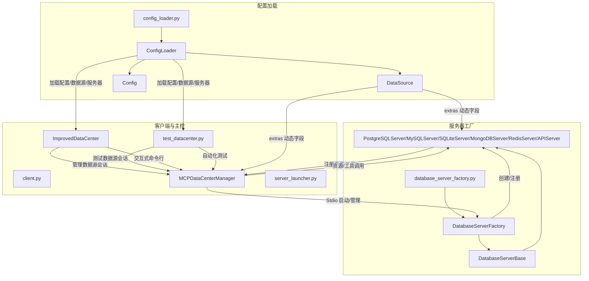

# MCP 数据中心工程说明

## 1. 模块结构与作用

### config_loader.py
- **ConfigLoader**：负责加载、解析、校验 config.yaml 配置文件，统一管理数据中心、数据源、服务器等配置信息。
- **DataSource**：数据源配置对象，所有动态字段（如 tables、headers、endpoints 等）都在 extras 字典中。
- **Config**：整体配置对象。

### database_server_factory.py
- **DatabaseServerFactory**：根据配置动态创建不同类型的数据库/服务（如 PostgreSQL、MySQL、SQLite、MongoDB、Redis、API等）的 MCP 服务器实例。
- **DatabaseServerBase 及其子类**：每种类型的数据库/服务对应一个子类，负责连接、资源注册、工具注册等。

### client.py
- **MCPDataCenterManager**：MCP 数据中心客户端管理器，负责通过 stdio 启动和管理各个 MCP 服务器的数据源连接，支持资源查询、工具调用、跨源查询等。

### server_launcher.py
- **ImprovedDataCenter**：数据中心主控脚本，负责加载配置、批量连接所有启用的数据源，提供交互式命令行界面，支持健康检查、资源/工具列举、资源查询、工具调用、跨源查询等功能。

### test_datacenter.py
- 自动化测试脚本，用于批量测试数据中心的连接、健康检查、资源/工具列举、资源查询、工具调用等功能。

---

## 2. 主要类与调用关系

---

## 3. 典型调用流程

1. **配置加载**：
   - `ConfigLoader` 加载 config.yaml，生成 `Config` 和 `DataSource` 对象。
2. **服务器创建**：
   - `DatabaseServerFactory` 根据 `DataSource` 类型创建对应的数据库/服务 MCP 服务器。
3. **数据中心管理**：
   - `server_launcher.py`/`test_datacenter.py` 通过 `MCPDataCenterManager` 启动和管理所有数据源的 MCP 服务器。
4. **资源/工具注册与调用**：
   - 各 MCP 服务器注册资源和工具，`MCPDataCenterManager` 通过 stdio 进行资源查询、工具调用、跨源查询等。
5. **交互与测试**：
   - `server_launcher.py` 提供交互式命令行，`test_datacenter.py` 实现自动化测试。

---

## 4. 说明
- 所有数据源的动态属性（如 tables、headers、endpoints 等）统一通过 `DataSource.extras` 字典访问。
- 各 MCP 服务器通过 `DatabaseServerFactory` 动态创建，注册资源和工具，供 client.py/server_launcher.py 通过 stdio 调用。
- 工程支持多种数据库和 API 类型的数据源统一管理和调用。
